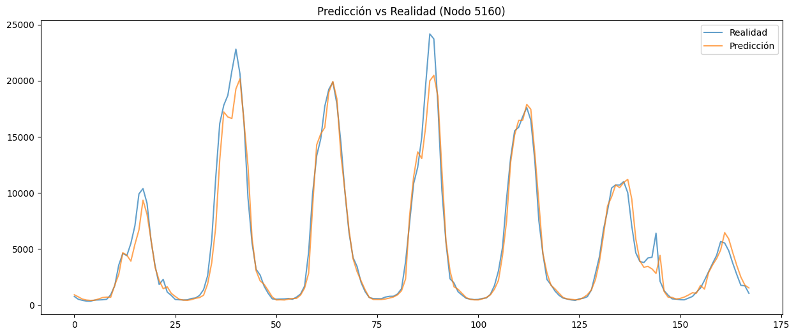
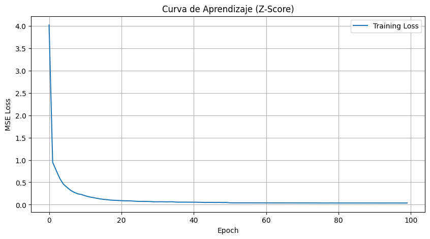
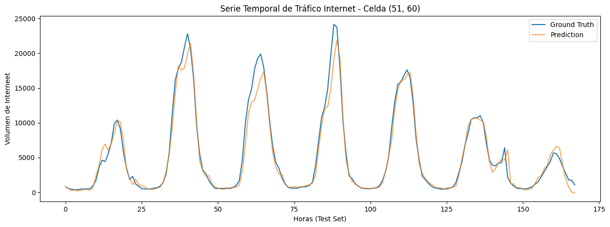
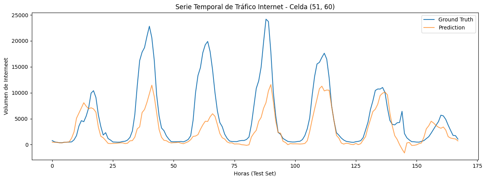
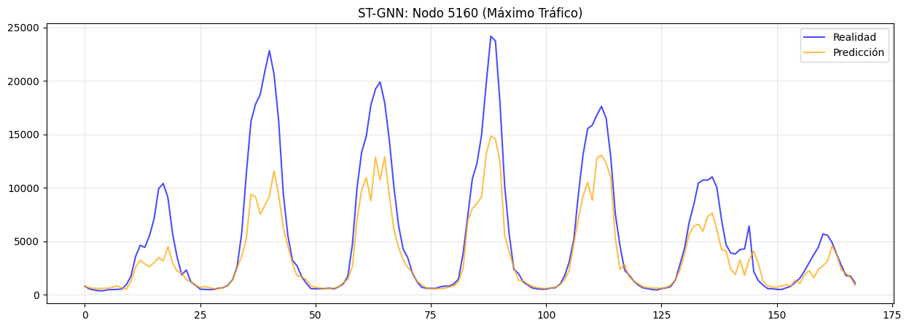
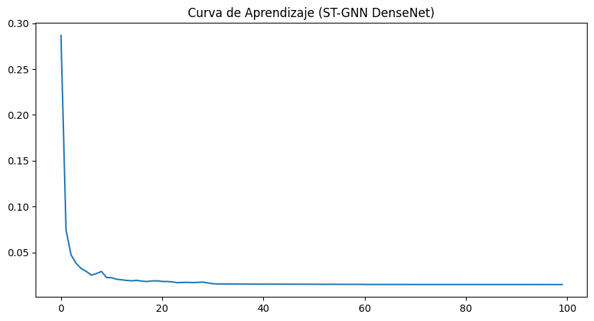
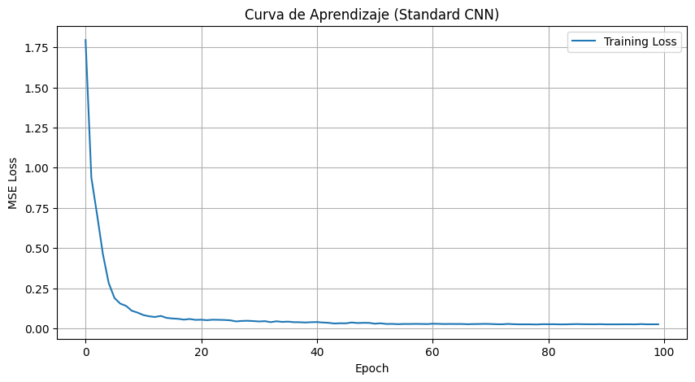

# Comparativa de Modelos de Predicción de Tráfico

Este reporte presenta una comparación detallada del rendimiento y eficiencia de los diferentes modelos implementados en el proyecto para la predicción de tráfico de Internet.

## 1. Métricas de Rendimiento

A continuación se detallan las métricas obtenidas por cada modelo tras el entrenamiento y la evaluación en el set de test.

| Modelo | Accuracy (1-WMAPE) | RMSE | MAE | R2 | WMAPE |
|:---|:---:|:---:|:---:|:---:|:---:|
| **GNN_Internet_Dense** | **90.37%** | **57.45** | **23.34** | **0.976** | **0.096** |
| **ConvLSTM** | 88.93% | 59.39 | 26.85 | 0.975 | 0.111 |
| **CNN_Internet** | 83.72% | 97.13 | 39.47 | 0.932 | 0.163 |
| **prediction_model_internet** | 83.21% | 103.34 | 40.70 | 0.921 | 0.168 |
| **GNN_Internet** | 79.28% | 128.85 | 50.22 | 0.880 | 0.207 |
| **CNN_Dense_Internet** | 78.07% | 118.96 | 53.16 | 0.898 | 0.219 |

---

## 2. Comparativa Visual: Real vs Predicción (Scatter Plots)

El gráfico de dispersión permite evaluar la correlación entre los valores reales y las predicciones. Una alineación estrecha con la diagonal roja (línea ideal $y=x$) indica un modelo altamente preciso.

````carousel

<!-- slide -->

<!-- slide -->

<!-- slide -->

<!-- slide -->

<!-- slide -->

````

### Análisis de Gráficos:
- **GNN_Internet_Dense & ConvLSTM:** Presentan las nubes de puntos más compactas alrededor de la diagonal, lo que confirma su alta puntuación en $R^2$ y bajo $RMSE$.
- **Modelos CNN:** Muestran una mayor dispersión, especialmente en valores bajos y medios de tráfico, sugiriendo dificultades para capturar variaciones locales finas.
- **prediction_model_internet:** Tras la corrección de variables, se observa una buena tendencia general, aunque con una varianza superior a los modelos de grafos.

---

## 3. Curvas de Pérdida (Convergencia)

La comparación de las curvas de *Loss* permite identificar la estabilidad del entrenamiento de cada arquitectura.

````carousel

<!-- slide -->

<!-- slide -->

````

---

## 4. Conclusiones Finales

1.  **Ganador por Precisión:** El modelo **GNN_Internet_Dense** es el más robusto, alcanzando un **90.37% de Accuracy**. Su arquitectura de grafos le permite aprovechar la estructura espacial de las cuadrículas de la ciudad.
2.  **Rendimiento Temporal:** **ConvLSTM** se posiciona como una excelente alternativa, destacando por su capacidad para modelar dependencias temporales complejas a largo plazo.
3.  **Optimizaciones:** La inclusión de conexiones residuo/compactas (arquitectura **Dense**) ha demostrado ser clave para superar los resultados de los baselines secuenciales (CNN estándar).
4.  **Calidad Visual:** Todas las visualizaciones han sido estandarizadas a un formato cuadrado de alta densidad para facilitar la auditoría visual y comparación directa.