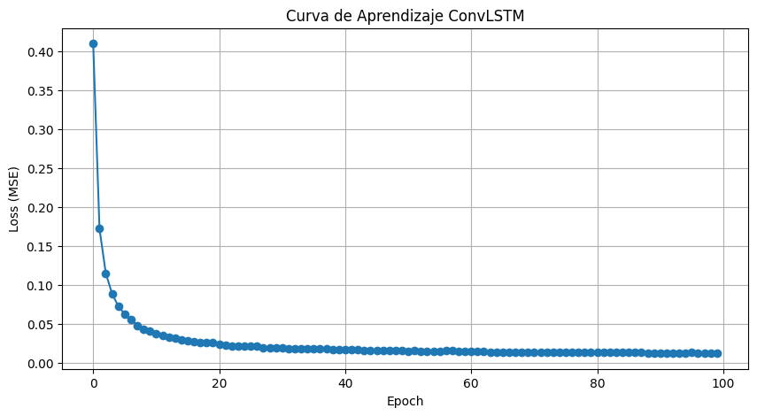
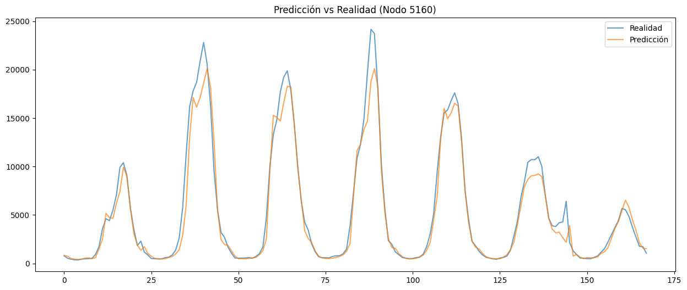
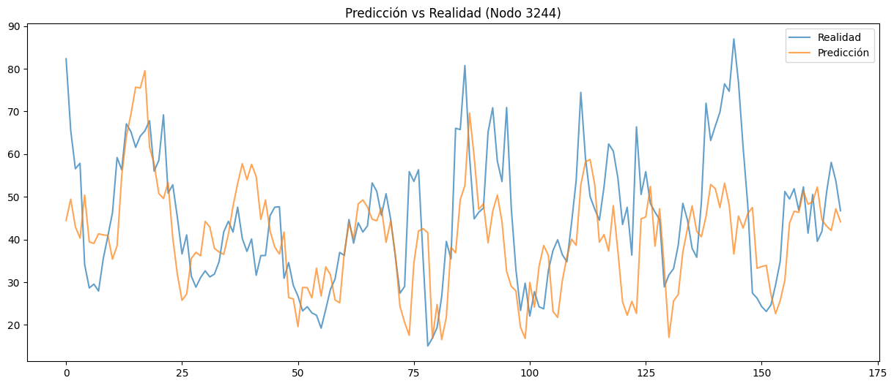
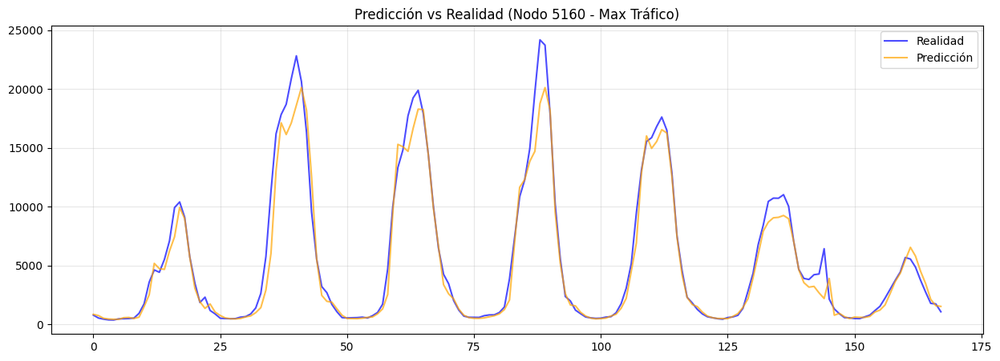
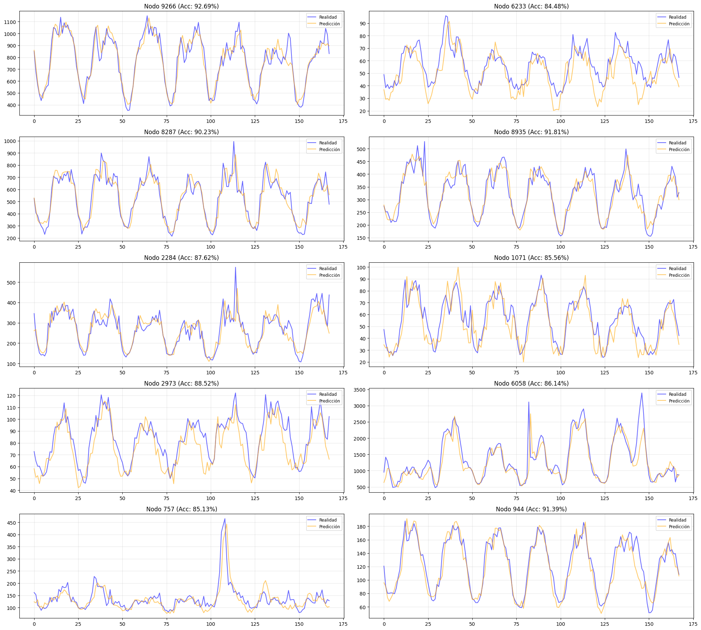

# Reporte de Visualizaciones: ConvLSTM

Este documento contiene las figuras extraídas del notebook `ConvLSTM.ipynb` con sus correspondientes explicaciones.

### Curvatura de Aprendizaje (Loss)

Muestra la evolución del error (MSE) durante el entrenamiento. Una curva descendente que se estabiliza indica que el modelo ha convergido correctamente.

---

### Serie Temporal: Nodos Aleatorios

Aquí se presentan comparaciones para nodos seleccionados al azar. Esto permite verificar la consistencia del modelo en diferentes partes de la red, no solo en los puntos críticos, asegurando que no haya sobreajuste a los nodos principales.

---

### Serie Temporal: Nodos Aleatorios

Aquí se presentan comparaciones para nodos seleccionados al azar. Esto permite verificar la consistencia del modelo en diferentes partes de la red, no solo en los puntos críticos, asegurando que no haya sobreajuste a los nodos principales.

---

### Serie Temporal: Nodos Aleatorios

Aquí se presentan comparaciones para nodos seleccionados al azar. Esto permite verificar la consistencia del modelo en diferentes partes de la red, no solo en los puntos críticos, asegurando que no haya sobreajuste a los nodos principales.

---

### Serie Temporal: Nodos Aleatorios

Aquí se presentan comparaciones para nodos seleccionados al azar. Esto permite verificar la consistencia del modelo en diferentes partes de la red, no solo en los puntos críticos, asegurando que no haya sobreajuste a los nodos principales.

---
